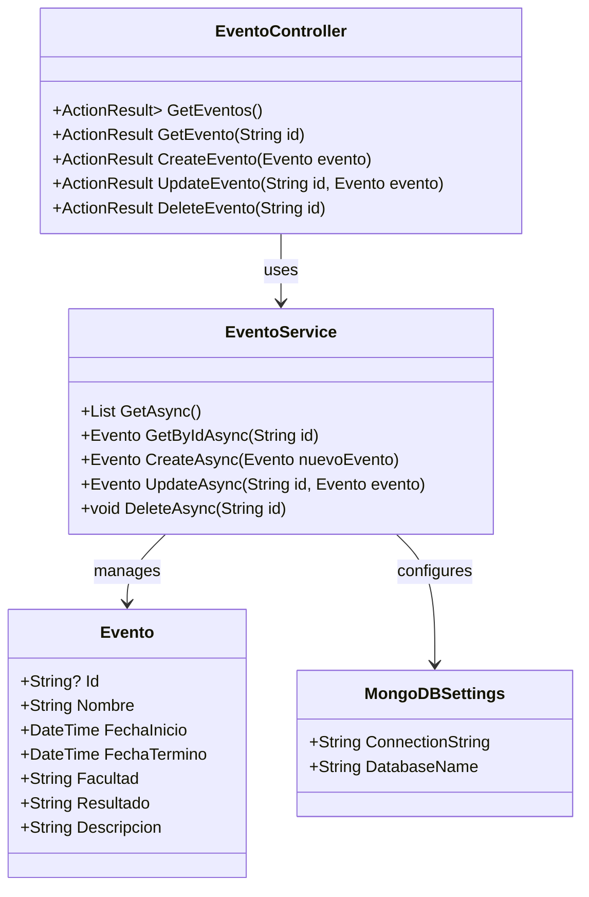
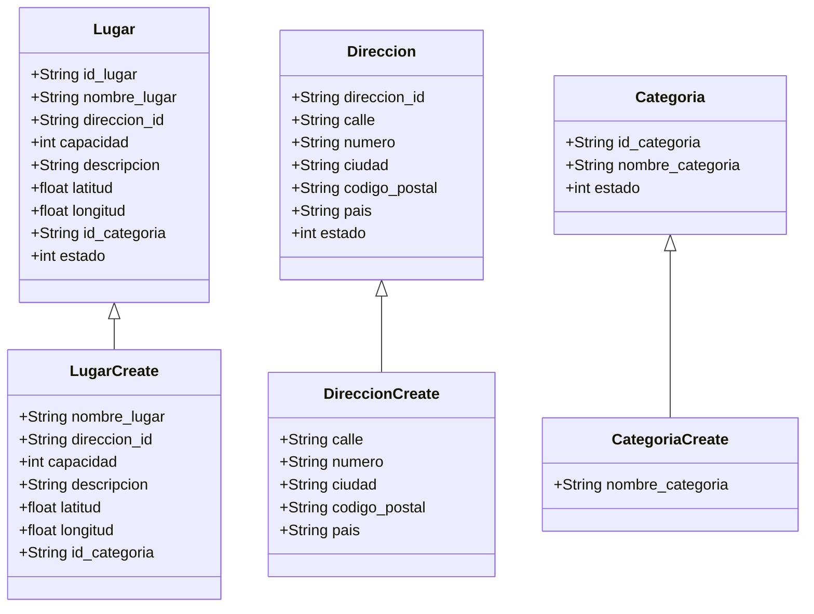

# Manual de Usuario
## 1. historia de usuario

   Desarrollo Web

   Activar filtro de eventos

   https://youtu.be/HW3N5lUZK30

|   Filtrar Eventos               | **Descripción**                                                                                                                                                                   |
|---------------------------------|-----------------------------------------------------------------------------------------------------------------------------------------------------------------------------------|
| **Como:**                       | Usuario del sistema de juegos florales                                                                                                                                           |
| **Quiero:**                     | Usar un filtro para visualizar los eventos vigentes                                                                                                                              |
| **Para que:**                   | Pueda ver solo los eventos actuales que se encuentran activos y programados                                                                                                       |
| **Criterios de Aceptación**     | - El usuario debe poder ver solo los eventos vigentes una vez aplicado el filtro.  - El filtro debe mostrar eventos organizados por fecha y categoría.                          |
| **Pantalla de Inicio de Sesión:** | La pantalla inicial debe solicitar al usuario su correo institucional para acceder al sistema. El usuario tiene opción de iniciar sesión manualmente o automáticamente.             |
| **Redirección a Microsoft:**    | Si el usuario selecciona autenticarse con su cuenta institucional, el sistema lo redirige a la página de inicio de sesión de Microsoft para autenticar sus credenciales.           |
| **Autenticación:**              | Una vez autenticado, el sistema debe validar las credenciales y verificar que el usuario esté autorizado a ingresar al sistema de juegos florales. En caso de éxito, el usuario es redirigido al dashboard principal. |
| **Inicio de Sesión Automático:** | Si el usuario ya ha iniciado sesión previamente en el sistema, el inicio de sesión automático permite que acceda directamente sin necesidad de introducir nuevamente las credenciales. |
| **Infraestructura:**            | El sistema debe estar integrado con Azure Active Directory para la autenticación, y debe contar con filtros dinámicos que permitan al usuario seleccionar y visualizar los eventos vigentes. También debe contar con un sistema de seguridad robusto para proteger los datos de autenticación y la información de los eventos. |

   Filtrar Eventos por Escuela entre otros:
   
   Facultad Arquitectura y Urbanismo
   
   https://youtu.be/kVukoFvcdJc
   
| Filtro Arquitectura y Urbanismo | **Descripción**                                                                                                                                                                   |
|---------------------------------|-----------------------------------------------------------------------------------------------------------------------------------------------------------------------------------|
| **Como:**                       | Usuario del sistema de juegos florales                                                                                                                                           |
| **Quiero:**                     | Filtrar los eventos por la Facultad de Arquitectura y Urbanismo                                                                                                                  |
| **Para que:**                   | Pueda ver solo los eventos organizados por la Facultad de Arquitectura y Urbanismo                                                                                                |
| **Criterios de Aceptación**     | - El usuario debe poder aplicar un filtro que muestre únicamente eventos relacionados con la Facultad de Arquitectura y Urbanismo.  - Los eventos deben estar organizados por fecha y categoría. |
| **Pantalla de Inicio de Sesión:** | La pantalla inicial debe solicitar al usuario su correo institucional para acceder al sistema. El usuario tiene opción de iniciar sesión manualmente o automáticamente.             |
| **Redirección a Microsoft:**    | Si el usuario selecciona autenticarse con su cuenta institucional, el sistema lo redirige a la página de inicio de sesión de Microsoft para autenticar sus credenciales.           |
| **Autenticación:**              | Una vez autenticado, el sistema debe validar las credenciales y verificar que el usuario esté autorizado a ingresar al sistema de juegos florales. En caso de éxito, el usuario es redirigido al dashboard principal. |
| **Inicio de Sesión Automático:** | Si el usuario ya ha iniciado sesión previamente en el sistema, el inicio de sesión automático permite que acceda directamente sin necesidad de introducir nuevamente las credenciales. |
| **Infraestructura:**            | El sistema debe estar integrado con Azure Active Directory para la autenticación, y debe contar con un filtro específico para que el usuario seleccione eventos de la Facultad de Arquitectura y Urbanismo. También debe garantizar la seguridad de la información. |
 
   Facultad Ciencias de la Salud

   https://youtu.be/39KIQJcTtpM
   
| Filtro Ciencias de la Salud     | **Descripción**                                                                                                                                                                   |
|---------------------------------|-----------------------------------------------------------------------------------------------------------------------------------------------------------------------------------|
| **Como:**                       | Usuario del sistema de juegos florales                                                                                                                                           |
| **Quiero:**                     | Filtrar los eventos por la Facultad de Ciencias de la Salud                                                                                                                      |
| **Para que:**                   | Pueda ver solo los eventos organizados por la Facultad de Ciencias de la Salud                                                                                                    |
| **Criterios de Aceptación**     | - El usuario debe poder aplicar un filtro que muestre únicamente eventos relacionados con la Facultad de Ciencias de la Salud.  - Los eventos deben estar organizados por fecha y categoría. |
| **Pantalla de Inicio de Sesión:** | La pantalla inicial debe solicitar al usuario su correo institucional para acceder al sistema. El usuario tiene opción de iniciar sesión manualmente o automáticamente.             |
| **Redirección a Microsoft:**    | Si el usuario selecciona autenticarse con su cuenta institucional, el sistema lo redirige a la página de inicio de sesión de Microsoft para autenticar sus credenciales.           |
| **Autenticación:**              | Una vez autenticado, el sistema debe validar las credenciales y verificar que el usuario esté autorizado a ingresar al sistema de juegos florales. En caso de éxito, el usuario es redirigido al dashboard principal. |
| **Inicio de Sesión Automático:** | Si el usuario ya ha iniciado sesión previamente en el sistema, el inicio de sesión automático permite que acceda directamente sin necesidad de introducir nuevamente las credenciales. |
| **Infraestructura:**            | El sistema debe estar integrado con Azure Active Directory para la autenticación, y debe contar con un filtro específico para que el usuario seleccione eventos de la Facultad de Ciencias de la Salud. También debe garantizar la seguridad de la información. |

   Facultad de Ingeniería

   https://youtu.be/37J0TCnbiII

| Filtro Ingeniería               | **Descripción**                                                                                                                                                                   |
|---------------------------------|-----------------------------------------------------------------------------------------------------------------------------------------------------------------------------------|
| **Como:**                       | Usuario del sistema de juegos florales                                                                                                                                           |
| **Quiero:**                     | Filtrar los eventos por la Facultad de Ingeniería                                                                                                                                |
| **Para que:**                   | Pueda ver solo los eventos organizados por la Facultad de Ingeniería                                                                                                             |
| **Criterios de Aceptación**     | - El usuario debe poder aplicar un filtro que muestre únicamente eventos relacionados con la Facultad de Ingeniería.  - Los eventos deben estar organizados por fecha y categoría. |
| **Pantalla de Inicio de Sesión:** | La pantalla inicial debe solicitar al usuario su correo institucional para acceder al sistema. El usuario tiene opción de iniciar sesión manualmente o automáticamente.             |
| **Redirección a Microsoft:**    | Si el usuario selecciona autenticarse con su cuenta institucional, el sistema lo redirige a la página de inicio de sesión de Microsoft para autenticar sus credenciales.           |
| **Autenticación:**              | Una vez autenticado, el sistema debe validar las credenciales y verificar que el usuario esté autorizado a ingresar al sistema de juegos florales. En caso de éxito, el usuario es redirigido al dashboard principal. |
| **Inicio de Sesión Automático:** | Si el usuario ya ha iniciado sesión previamente en el sistema, el inicio de sesión automático permite que acceda directamente sin necesidad de introducir nuevamente las credenciales. |
| **Infraestructura:**            | El sistema debe estar integrado con Azure Active Directory para la autenticación, y debe contar con un filtro específico para que el usuario seleccione eventos de la Facultad de Ingeniería. También debe garantizar la seguridad de la información. |

   Facultad Derecho y Ciencias Políticas

   https://youtu.be/Iy6awq4nASg

| Facultad Derecho y Ciencias P.  | **Descripción**                                                                                                                                                                   |
|---------------------------------|-----------------------------------------------------------------------------------------------------------------------------------------------------------------------------------|
| **Como:**                       | Usuario del sistema de juegos florales                                                                                                                                           |
| **Quiero:**                     | Filtrar los eventos por la Facultad de Ingeniería                                                                                                                                |
| **Para que:**                   | Pueda ver solo los eventos organizados por la Facultad de Ingeniería                                                                                                             |
| **Criterios de Aceptación**     | - El usuario debe poder aplicar un filtro que muestre únicamente eventos relacionados con la Facultad de Ingeniería.  - Los eventos deben estar organizados por fecha y categoría. |
| **Pantalla de Inicio de Sesión:** | La pantalla inicial debe solicitar al usuario su correo institucional para acceder al sistema. El usuario tiene opción de iniciar sesión manualmente o automáticamente.             |
| **Redirección a Microsoft:**    | Si el usuario selecciona autenticarse con su cuenta institucional, el sistema lo redirige a la página de inicio de sesión de Microsoft para autenticar sus credenciales.           |
| **Autenticación:**              | Una vez autenticado, el sistema debe validar las credenciales y verificar que el usuario esté autorizado a ingresar al sistema de juegos florales. En caso de éxito, el usuario es redirigido al dashboard principal. |
| **Inicio de Sesión Automático:** | Si el usuario ya ha iniciado sesión previamente en el sistema, el inicio de sesión automático permite que acceda directamente sin necesidad de introducir nuevamente las credenciales. |
| **Infraestructura:**            | El sistema debe estar integrado con Azure Active Directory para la autenticación, y debe contar con un filtro específico para que el usuario seleccione eventos de la Facultad de Ingeniería. También debe garantizar la seguridad de la información. |

   Facultad de Ciencias Empresariales

   https://youtu.be/h_f-CLEEn5Y

| Facultad de Ciencias Emp.       | **Descripción**                                                                                                                                                                   |
|---------------------------------|-----------------------------------------------------------------------------------------------------------------------------------------------------------------------------------|
| **Como:**                       | Usuario del sistema de juegos florales                                                                                                                                           |
| **Quiero:**                     | Filtrar los eventos por la Facultad de Ciencias Empresariales                                                                                                                    |
| **Para que:**                   | Pueda ver solo los eventos organizados por la Facultad de Ciencias Empresariales                                                                                                  |
| **Criterios de Aceptación**     | - El usuario debe poder aplicar un filtro que muestre únicamente eventos relacionados con la Facultad de Ciencias Empresariales.  - Los eventos deben estar organizados por fecha y categoría. |
| **Pantalla de Inicio de Sesión:** | La pantalla inicial debe solicitar al usuario su correo institucional para acceder al sistema. El usuario tiene opción de iniciar sesión manualmente o automáticamente.             |
| **Redirección a Microsoft:**    | Si el usuario selecciona autenticarse con su cuenta institucional, el sistema lo redirige a la página de inicio de sesión de Microsoft para autenticar sus credenciales.           |
| **Autenticación:**              | Una vez autenticado, el sistema debe validar las credenciales y verificar que el usuario esté autorizado a ingresar al sistema de juegos florales. En caso de éxito, el usuario es redirigido al dashboard principal. |
| **Inicio de Sesión Automático:** | Si el usuario ya ha iniciado sesión previamente en el sistema, el inicio de sesión automático permite que acceda directamente sin necesidad de introducir nuevamente las credenciales. |
| **Infraestructura:**            | El sistema debe estar integrado con Azure Active Directory para la autenticación, y debe contar con un filtro específico para que el usuario seleccione eventos de la Facultad de Ciencias Empresariales. También debe garantizar la seguridad de la información. |

   Facultades en general

   https://youtu.be/St7qzknR9_A

| Facultades en general           | **Descripción**                                                                                                                                                                   |
|---------------------------------|-----------------------------------------------------------------------------------------------------------------------------------------------------------------------------------|
| **Como:**                       | Usuario del sistema de juegos florales                                                                                                                                           |
| **Quiero:**                     | Filtrar los eventos entre todas las facultades                                                                                                                                    |
| **Para que:**                   | Pueda ver los eventos organizados por todas las facultades de la universidad                                                                                                      |
| **Criterios de Aceptación**     | - El usuario debe poder aplicar un filtro que muestre todos los eventos de las diferentes facultades.  - Los eventos deben estar organizados por fecha y categoría.              |
| **Pantalla de Inicio de Sesión:** | La pantalla inicial debe solicitar al usuario su correo institucional para acceder al sistema. El usuario tiene opción de iniciar sesión manualmente o automáticamente.             |
| **Redirección a Microsoft:**    | Si el usuario selecciona autenticarse con su cuenta institucional, el sistema lo redirige a la página de inicio de sesión de Microsoft para autenticar sus credenciales.           |
| **Autenticación:**              | Una vez autenticado, el sistema debe validar las credenciales y verificar que el usuario esté autorizado a ingresar al sistema de juegos florales. En caso de éxito, el usuario es redirigido al dashboard principal. |
| **Inicio de Sesión Automático:** | Si el usuario ya ha iniciado sesión previamente en el sistema, el inicio de sesión automático permite que acceda directamente sin necesidad de introducir nuevamente las credenciales. |
| **Infraestructura:**            | El sistema debe estar integrado con Azure Active Directory para la autenticación, y debe contar con un filtro que permita seleccionar y visualizar eventos de todas las facultades. También debe garantizar la seguridad de la información. |

   https://youtu.be/akh48sIgeqU

   
## 2. Especificaciones

   
   ### 2.1 Inicio de Sesión

      Requisitos del Sistema
   
     - Pagina Web: React librería necesaria para construir la interfaz de usuario
     - App Mobile: Flutter framework utilizado para crear aplicaciones móviles, web y de escritorio
     - Backend: Python lenguaje de programación de alto nivel, interpretado y de propósito general, conocido por su 
       simplicidad y legibilidad.
   
   ### 2.2 Listar Eventos
  
     Requisitos del Sistema
  
   - Pagina Web: React librería necesaria para construir la interfaz de usuario
   - App Mobile: Flutter framework utilizado para crear aplicaciones móviles, web y de escritorio
   - Backend: C# para el codigo donde se uso MongoDB.Driver

# Manual Tecnico
## 1. Diagrama de Clases

   Desarrollo Web

   

Descripción: Este diagrama de clases muestra la estructura de una aplicación web .Consta de tres clases principales: "App", "Login" y "Eventos". La clase "App" es la clase central, con un método render(), y se conecta a las otras dos clases mediante relaciones etiquetadas como "Renders". La clase "Login" tiene métodos para manejar el inicio de sesión (handleLogin()) y renderizar su interfaz. La clase "Eventos" maneja la visualización y carga de eventos, con atributos para eventos, estado de carga y errores, y métodos para renderizar y obtener eventos (fetchEvents()). Esta estructura sugiere una arquitectura de componentes típica de frameworks modernos de desarrollo web, donde cada componente es responsable de su propia lógica y representación visual.

   Desarrollo Movil

   
   Descripción: Este diagrama de clases muestra la estructura de una aplicación, probablemente desarrollada con Flutter, que gestiona equipos, participantes y eventos. La aplicación se compone de una clase principal (MyApp), una página de inicio (MyHomePage), un servicio de autenticación (AuthService), y varias pantallas específicas para diferentes funcionalidades. La estructura incluye modelos de datos (Equipo, Participante, Evento) y utiliza navegación entre pantallas, sugiriendo una aplicación bien organizada para la gestión de torneos o eventos deportivos.

   

   
   

   API EVENTOS

- Clase `Evento`: La clase `Evento` representa la estructura de un evento en el sistema, conteniendo propiedades como el identificador, nombre, fechas de inicio y término, facultad asociada, resultado y una descripción del evento. Esta clase se utiliza para almacenar y transferir datos relacionados con los eventos en la aplicación.

- Clase `MongoDBSettings`: La clase `MongoDBSettings` encapsula la configuración necesaria para conectarse a una base de datos de MongoDB, incluyendo la cadena de conexión y el nombre de la base de datos. Proporciona una forma de gestionar y acceder a estos parámetros de configuración de manera estructurada.

- Clase `EventoService`: La clase `EventoService` se encarga de la lógica de negocio relacionada con la gestión de eventos. Se encarga de interactuar con la base de datos de MongoDB, facilitando operaciones de lectura y escritura sobre los documentos de eventos y asegurando que la lógica del sistema se mantenga separada de los detalles de la base de datos.

- Clase `EventoController`: El `EventoController` actúa como intermediario entre las solicitudes HTTP y el servicio de eventos. Se encarga de recibir y procesar las solicitudes relacionadas con los eventos, delegando la lógica de negocio al `EventoService` y devolviendo las respuestas adecuadas al cliente.

   API LUGARES

- Clase Lugar: Representa un lugar en el sistema, con propiedades que incluyen el identificador, nombre, dirección, capacidad, descripción, coordenadas geográficas y estado. Esta clase es fundamental para la gestión de lugares dentro de la API, permitiendo operaciones relacionadas con su creación y consulta.

- Clase Direccion: Define la estructura de una dirección, con atributos como identificador, calle, número, ciudad, código postal y país. Incluye un estado que permite gestionar su validez y asociación con los lugares.

- Clase Categoria: Representa la categoría a la que pertenece un lugar, con propiedades que incluyen un identificador y nombre de la categoría. Su estado permite organizar los lugares según diferentes clasificaciones.

- Clase LugarCreate: Extiende la clase Lugar, proporcionando un modelo simplificado para la creación de nuevos lugares. Incluye las propiedades necesarias sin el identificador y estado, facilitando la entrada de datos.

- Clase DireccionCreate: Similar a Direccion, esta clase proporciona un modelo para la creación de nuevas direcciones, omitiendo el identificador y estado para simplificar la entrada de datos.

- Clase CategoriaCreate: Proporciona un modelo para la creación de nuevas categorías, incluyendo solo el nombre de la categoría, lo que permite la adición sencilla de nuevas clasificaciones a la API.

## 2. Arquitectura del Sistema

Desarrollo web

Desarrollo Movil

API eventos

API Lugares

## 3. Diagrama de Despliegue
Obtenido del Repositorio de Api back donde uso terraform como infraestructura
https://github.com/UPT-FAING-EPIS/proyecto-si8811a-2024-ii-u1-desarrollo-api-back/tree/main

Infraestructura 

Backend_api 

mobile_app infraestructura

web_app Infraestructura

