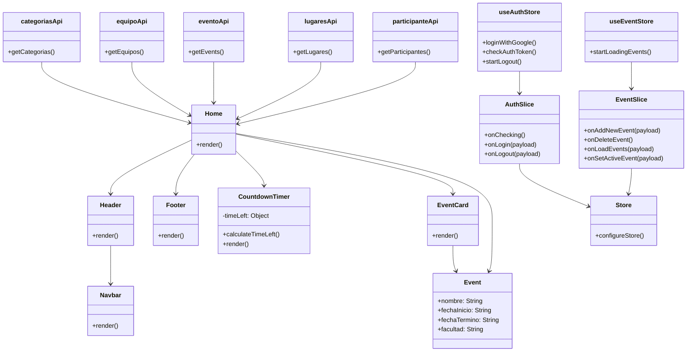
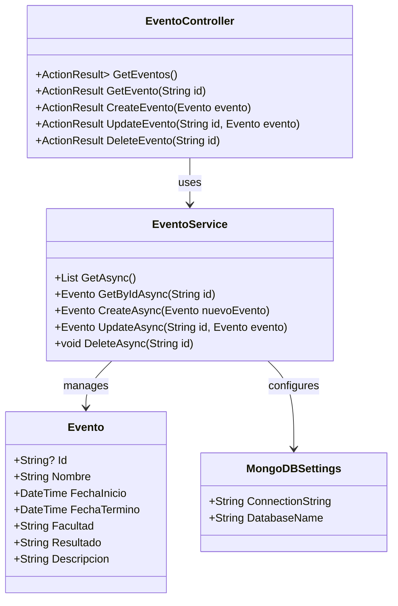
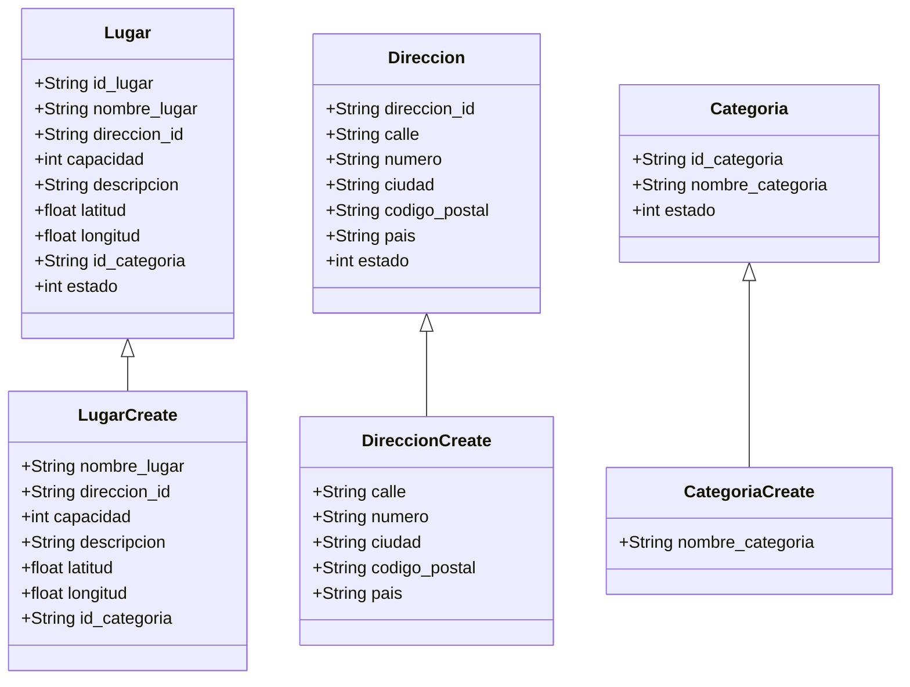

# Manual Tecnico
## 1. Diagrama de Clases

   ### Desarrollo Web
   

Descripción: Este diagrama de clases muestra la estructura de una aplicación web .Consta de tres clases principales: "App", "Login" y "Eventos". La clase "App" es la clase central, con un método render(), y se conecta a las otras dos clases mediante relaciones etiquetadas como "Renders". La clase "Login" tiene métodos para manejar el inicio de sesión (handleLogin()) y renderizar su interfaz. La clase "Eventos" maneja la visualización y carga de eventos, con atributos para eventos, estado de carga y errores, y métodos para renderizar y obtener eventos (fetchEvents()). Esta estructura sugiere una arquitectura de componentes típica de frameworks modernos de desarrollo web, donde cada componente es responsable de su propia lógica y representación visual.

### Desarrollo Movil

   
   
   Descripción: Este diagrama de clases muestra la estructura de una aplicación, desarrollada con Flutter, que gestiona equipos, participantes y eventos. La aplicación se compone de una clase principal (MyApp), una página de inicio (MyHomePage), un servicio de autenticación (AuthService), y varias pantallas específicas para diferentes funcionalidades. La estructura incluye modelos de datos (Equipo, Participante, Evento) y utiliza navegación entre pantallas, sugiriendo una aplicación bien organizada para la gestión de torneos o eventos deportivos.

   

Descripción: Este diagrama de clases muestra la estructura de una aplicación con tres clases principales: Main, MyApplication y GeneratedPluginRegistrant. La clase Main contiene el método main(), punto de entrada de la aplicación. MyApplication hereda de GtkApplication y gestiona el ciclo de vida de la aplicación con métodos como OnCreate() y OnDestroy(). También utiliza GeneratedPluginRegistrant para registrar plugins. Esta estructura sugiere una aplicación basada en GTK, posiblemente desarrollada con Flutter para desktop, que maneja plugins y tiene una configuración inicial definida.

   
   
Descripción: Este diagrama de clases muestra la estructura de una aplicación Flutter para Windows. Consta de cuatro clases principales: Main (punto de entrada), Runner (inicializa la aplicación), FlutterWindow (maneja la ventana principal de Flutter) y Win32Window (implementación específica para Windows). La jerarquía ilustra cómo la aplicación Flutter se integra con la plataforma Windows, gestionando el ciclo de vida de la ventana y los eventos del sistema. Esta estructura permite que una aplicación Flutter se ejecute como una aplicación de escritorio nativa en Windows.
   

   ### API EVENTOS
```
```


- Clase `Evento`: La clase `Evento` representa la estructura de un evento en el sistema, conteniendo propiedades como el identificador, nombre, fechas de inicio y término, facultad asociada, resultado y una descripción del evento. Esta clase se utiliza para almacenar y transferir datos relacionados con los eventos en la aplicación.

- Clase `MongoDBSettings`: La clase `MongoDBSettings` encapsula la configuración necesaria para conectarse a una base de datos de MongoDB, incluyendo la cadena de conexión y el nombre de la base de datos. Proporciona una forma de gestionar y acceder a estos parámetros de configuración de manera estructurada.

- Clase `EventoService`: La clase `EventoService` se encarga de la lógica de negocio relacionada con la gestión de eventos. Se encarga de interactuar con la base de datos de MongoDB, facilitando operaciones de lectura y escritura sobre los documentos de eventos y asegurando que la lógica del sistema se mantenga separada de los detalles de la base de datos.

- Clase `EventoController`: El `EventoController` actúa como intermediario entre las solicitudes HTTP y el servicio de eventos. Se encarga de recibir y procesar las solicitudes relacionadas con los eventos, delegando la lógica de negocio al `EventoService` y devolviendo las respuestas adecuadas al cliente.

   API LUGARES


- Clase Lugar: Representa un lugar en el sistema, con propiedades que incluyen el identificador, nombre, dirección, capacidad, descripción, coordenadas geográficas y estado. Esta clase es fundamental para la gestión de lugares dentro de la API, permitiendo operaciones relacionadas con su creación y consulta.

- Clase Direccion: Define la estructura de una dirección, con atributos como identificador, calle, número, ciudad, código postal y país. Incluye un estado que permite gestionar su validez y asociación con los lugares.

- Clase Categoria: Representa la categoría a la que pertenece un lugar, con propiedades que incluyen un identificador y nombre de la categoría. Su estado permite organizar los lugares según diferentes clasificaciones.

- Clase LugarCreate: Extiende la clase Lugar, proporcionando un modelo simplificado para la creación de nuevos lugares. Incluye las propiedades necesarias sin el identificador y estado, facilitando la entrada de datos.

- Clase DireccionCreate: Similar a Direccion, esta clase proporciona un modelo para la creación de nuevas direcciones, omitiendo el identificador y estado para simplificar la entrada de datos.

- Clase CategoriaCreate: Proporciona un modelo para la creación de nuevas categorías, incluyendo solo el nombre de la categoría, lo que permite la adición sencilla de nuevas clasificaciones a la API.

## 2. Arquitectura del Sistema

Desarrollo web


Descripción Este diagrama muestra la arquitectura del proyecto de desarrollo web, probablemente utilizando React y Vite. La estructura se divide en carpetas 'public' y 'src', con 'index.html' como punto de entrada. El archivo 'main.jsx' inicializa la aplicación, que renderiza componentes como 'eventos.jsx' y 'login.jsx'. Se incluyen archivos de configuración para herramientas como ESLint, PostCSS y Tailwind, así como archivos de gestión de paquetes y documentación. Esta organización refleja una arquitectura moderna de desarrollo frontend con separación clara de componentes y configuraciones.

Desarrollo Movil


API eventos


Descripción: La estructura sigue un patrón MVC (Model-View-Controller) con capas adicionales de Servicios y Configuración. El núcleo es 'Program.cs', que interactúa con componentes como 'EventoController.cs', 'EventoService.cs', y 'Evento.cs' (modelo). La configuración incluye 'MongoDBSettings.cs' y 'launchSettings.json'. El proyecto parece estar preparado para despliegue con Docker, como lo indica la presencia del 'Dockerfile'.

API Lugares


Descripción: Se divide en dos carpetas principales: 'app' y 'tests'. La carpeta 'app' contiene los archivos core de la aplicación (main.py, models.py, crud.py, schemas.py), mientras que 'tests' incluye archivos para pruebas unitarias. El proyecto utiliza Docker para el despliegue (Dockerfile y docker-compose.yml) y maneja dependencias con requirements.txt. Esta estructura sugiere una API bien organizada con separación clara entre código de producción y pruebas.

## 3. Diagrama de Despliegue
Obtenido del Repositorio de Api back donde uso terraform como infraestructura
https://github.com/UPT-FAING-EPIS/proyecto-si8811a-2024-ii-u1-desarrollo-api-back/tree/main

Infraestructura 

 para definir y gestionar los recursos de manera declarativa, posiblemente utilizando herramientas como Terraform.

Backend_api 


mobile_app infraestructura


web_app Infraestructura


